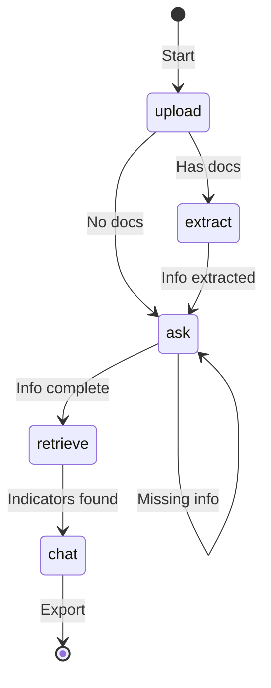
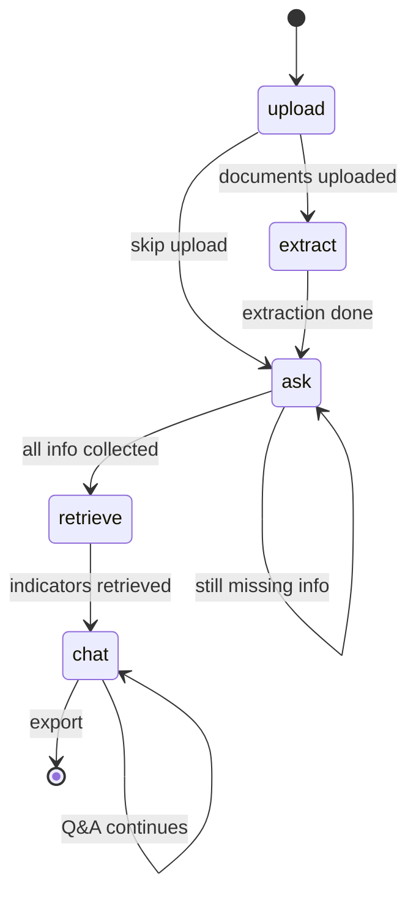

# Design Document: Workflow Refactor

## Overview

This design adds minimal workflow enforcement to the existing CBA Indicator Selection Assistant. Instead of a free-form chatbot, the system will guide users through a structured process: upload documents → extract info → fill gaps → get indicators → ask questions.

**IMPORTANT: This work will be done on a NEW BRANCH** to safely refine the system without disrupting the current main branch implementation.

**Design Principles**:
- **Minimal changes** to existing `app.py`
- **No new classes** - just simple functions
- **Direct boto3** for Knowledge Base queries
- **Keep Strands** where it already works
- **Session state** for workflow tracking
- **New branch** i.e. not main for safe development

## Architecture

### Simple Flow



### What Changes

**In `app.py`**:
1. Add workflow phase to session state
2. Show different UI based on phase
3. Replace `memory()` tool with direct boto3 calls
4. Add simple validation before moving phases

**New file: `src/workflow.py`**:
- Simple helper functions
- No classes, no abstractions
- Direct boto3 usage for KB

### State Flow Diagram



## Components and Interfaces

### Session State Structure

Add to existing `st.session_state`:

```python
# Workflow tracking
st.session_state.workflow_phase = "upload"  # upload, extract, ask, retrieve, chat

# Project info
st.session_state.project_info = {
    "location": None,
    "project_type": None,
    "outcomes": [],
    "budget": None,
    "capacity": None,
    "documents_uploaded": False
}

# Retrieved indicators
st.session_state.indicators = []
```

### New File: `src/workflow.py`

Simple helper functions - no classes:

```python
import boto3
from strands import Agent
from strands_tools import use_llm

# Direct boto3 clients
bedrock_runtime = boto3.client('bedrock-agent-runtime', region_name='us-west-2')
s3_client = boto3.client('s3')

# S3 bucket for document uploads
S3_BUCKET = 'cba-project-docs'

def upload_document_to_s3(file_content: bytes, filename: str) -> str:
    """Upload document to S3 bucket and return key"""
    key = f"uploads/{datetime.now().strftime('%Y%m%d')}/{filename}"
    s3_client.put_object(
        Bucket=S3_BUCKET,
        Key=key,
        Body=file_content
    )
    return key

def query_knowledge_base(query: str) -> dict:
    """Direct boto3 call to KB - replaces memory() tool"""
    response = bedrock_runtime.retrieve_and_generate(
        input={'text': query},
        retrieveAndGenerateConfiguration={
            'type': 'KNOWLEDGE_BASE',
            'knowledgeBaseConfiguration': {
                'knowledgeBaseId': '0ZQBMXEKDI',
                'modelArn': 'arn:aws:bedrock:us-west-2::foundation-model/us.anthropic.claude-sonnet-4-5-20250929-v1:0'
            }
        }
    )
    return response

def extract_project_info(text: str) -> dict:
    """Use Strands agent to extract structured info from text"""
    agent = Agent(
        model=MODEL_ID,
        tools=[use_llm],
        system_prompt="Extract: location, project_type, outcomes, budget, capacity as JSON"
    )
    result = agent(text)
    return parse_json(result)

def get_missing_fields(project_info: dict) -> list:
    """Check what's still needed"""
    required = ['location', 'project_type', 'outcomes', 'budget', 'capacity']
    return [f for f in required if not project_info.get(f)]

def is_info_complete(project_info: dict) -> bool:
    """Check if we can proceed to indicator retrieval"""
    return len(get_missing_fields(project_info)) == 0
```

### Changes to `app.py`

Minimal modifications to existing code:

```python
# At the top, import workflow helpers
from workflow import (
    query_knowledge_base,
    extract_project_info,
    get_missing_fields,
    is_info_complete
)

# In initialize_session_state(), add:
if 'workflow_phase' not in st.session_state:
    st.session_state.workflow_phase = 'upload'
if 'project_info' not in st.session_state:
    st.session_state.project_info = {
        'location': None,
        'project_type': None,
        'outcomes': [],
        'budget': None,
        'capacity': None,
        'documents_uploaded': False
    }
if 'indicators' not in st.session_state:
    st.session_state.indicators = []

# In main(), show different UI based on phase:
phase = st.session_state.workflow_phase

if phase == 'upload':
    # Show file uploader prominently
    # Button: "Skip to manual entry" → phase = 'ask'
    # On upload → extract text → phase = 'extract'
    
elif phase == 'extract':
    # Show "Extracting information..."
    # Call extract_project_info(text)
    # Update project_info
    # phase = 'ask'
    
elif phase == 'ask':
    # Show form for missing fields
    # Display: "We need: location, budget..."
    # On submit → update project_info
    # If complete → phase = 'retrieve'
    
elif phase == 'retrieve':
    # Build query from project_info
    # Call query_knowledge_base(query)
    # Store in st.session_state.indicators
    # phase = 'chat'
    
elif phase == 'chat':
    # Show indicators
    # Allow Q&A about indicators
    # Use query_knowledge_base() for follow-ups
    # Show export button
```

## Data Models

### Project Info Dictionary

```python
{
    "location": str,           # "Chad" or "lat,lon"
    "project_type": str,       # "cotton farming"
    "outcomes": list[str],     # ["soil health", "water use"]
    "budget": str,             # "low", "medium", "high"
    "capacity": str,           # "basic", "intermediate", "advanced"
    "documents_uploaded": bool
}
```

### Indicator Structure

```python
{
    "id": str,
    "name": str,
    "definition": str,
    "method": str,
    "rationale": str,
    "attributes": {
        "accuracy": str,
        "ease_of_use": str,
        "cost": str
    }
}
```

## Correctness Properties

*A property is a characteristic or behavior that should hold true across all valid executions of a system—essentially, a formal statement about what the system should do. Properties serve as the bridge between human-readable specifications and machine-verifiable correctness guarantees.*

### Simplified Properties

**Property 1: Phase Progression**
*For any* workflow state, phase transitions should only move forward in sequence: upload → extract → ask → retrieve → chat
**Validates: Requirements 1.1, 1.2, 1.4**

**Property 2: Information Completeness**
*For any* project_info dict, the system should correctly identify missing required fields and only proceed to retrieval when all fields are present
**Validates: Requirements 4.1, 4.2, 4.5**

**Property 3: Direct KB Access**
*For any* Knowledge Base query, the system should use direct boto3 calls without Strands memory abstraction
**Validates: Requirements 5.1, 5.2, 5.3**

**Property 4: Indicator Retrieval**
*For any* complete project_info, the system should build a deterministic query and retrieve indicators from the KB
**Validates: Requirements 5.3, 5.4, 5.5**

**Property 5: Chat Constraints**
*For any* user message in chat phase, responses should only reference retrieved indicators or make additional KB queries
**Validates: Requirements 6.2, 6.3, 6.5**

## Error Handling

Simple error handling without over-engineering:

**File Processing**:
- Try/except around file operations
- Show error message to user
- Don't crash, stay in current phase

**KB Queries**:
- Timeout after 30 seconds
- Retry once on failure
- Show "KB unavailable" message

**Extraction**:
- If extraction fails, fall back to manual entry
- Transition to 'ask' phase

**State Validation**:
- Check for None values before proceeding
- Validate phase transitions are valid

## Testing Strategy

### Unit Tests

Focus on the simple functions in `workflow.py`:

```python
def test_get_missing_fields():
    info = {'location': 'Chad', 'project_type': None}
    missing = get_missing_fields(info)
    assert 'project_type' in missing
    assert 'location' not in missing

def test_is_info_complete():
    complete = {'location': 'Chad', 'project_type': 'cotton', ...}
    assert is_info_complete(complete) == True
    
    incomplete = {'location': 'Chad', 'project_type': None, ...}
    assert is_info_complete(incomplete) == False

def test_query_knowledge_base():
    # Mock boto3 response
    result = query_knowledge_base("cotton indicators Chad")
    assert 'output' in result
```

### Integration Tests

Test the workflow in `app.py`:

```python
def test_phase_progression():
    # Start at upload
    # Upload file → should move to extract
    # Extract → should move to ask
    # Complete info → should move to retrieve
    # Retrieve → should move to chat

def test_missing_info_blocks_retrieval():
    # Set incomplete project_info
    # Try to move to retrieve phase
    # Should stay in ask phase
```

### Property-Based Tests

Use `hypothesis` for key properties:

```python
@given(st.dictionaries(
    keys=st.sampled_from(['location', 'project_type', 'outcomes', 'budget', 'capacity']),
    values=st.one_of(st.none(), st.text())
))
def test_completeness_check(project_info):
    missing = get_missing_fields(project_info)
    complete = is_info_complete(project_info)
    
    # Property: complete should be True only when no missing fields
    assert complete == (len(missing) == 0)
```

## Implementation Notes

### Branch Strategy

**IMPORTANT: All work happens on a new branch**

```bash
# Create and switch to new branch
git checkout -b feature/workflow-refactor

# Do all development here
# Test thoroughly
# Only merge to main when stable
```

This ensures:
- Main branch stays stable
- Can test workflow changes safely
- Easy to revert if needed
- Can iterate without breaking production

### What to Build

**New file: `src/workflow.py`** (~100 lines)
- 4-5 simple functions
- Direct boto3 client
- No classes

**Modify: `src/app.py`** (~50 lines changed)
- Add workflow_phase to session state
- Add phase-based UI rendering
- Replace memory() calls with query_knowledge_base()
- Add simple validation

**Keep unchanged**:
- `src/config.py`
- `src/agent.py` (CLI still works as-is)
- All existing file processing code
- All existing UI styling

### Migration Path

1. **Create branch** `feature/workflow-refactor`
2. **Add `workflow.py`** with helper functions
3. **Update `app.py`** session state initialization
4. **Add phase-based UI** rendering
5. **Replace memory() calls** with direct boto3
6. **Test** each phase works
7. **Merge to main** when stable

### Performance

- Session state access: instant
- boto3 KB queries: ~2-5 seconds
- File extraction: ~1-2 seconds
- Phase transitions: instant

### Security

- Same AWS credentials as before
- S3 bucket: `cba-project-docs` for document uploads
- S3 objects use date-based prefixes for organization
- No new security concerns