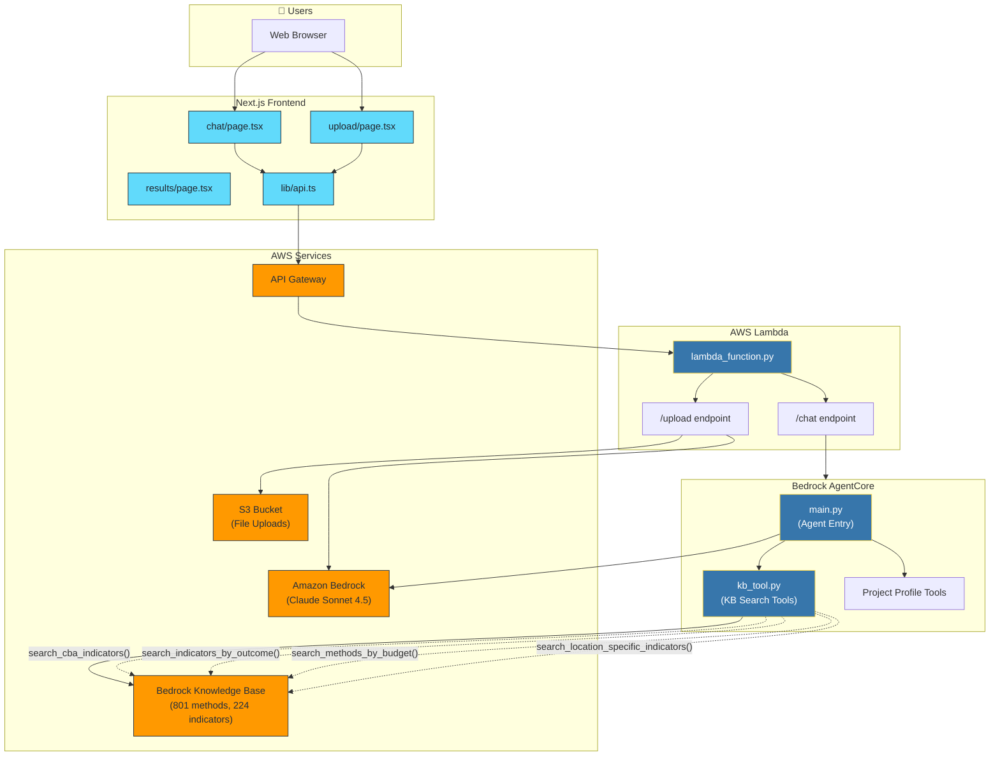
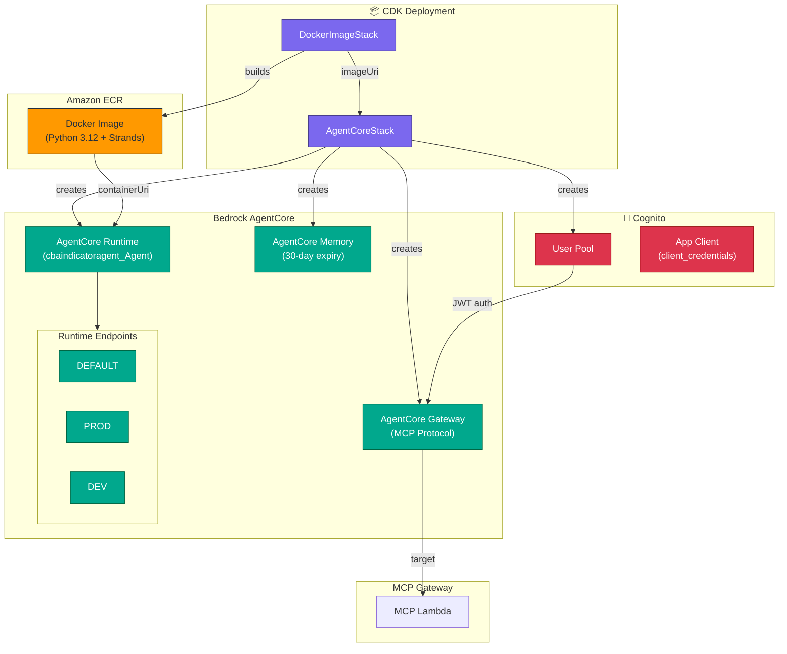
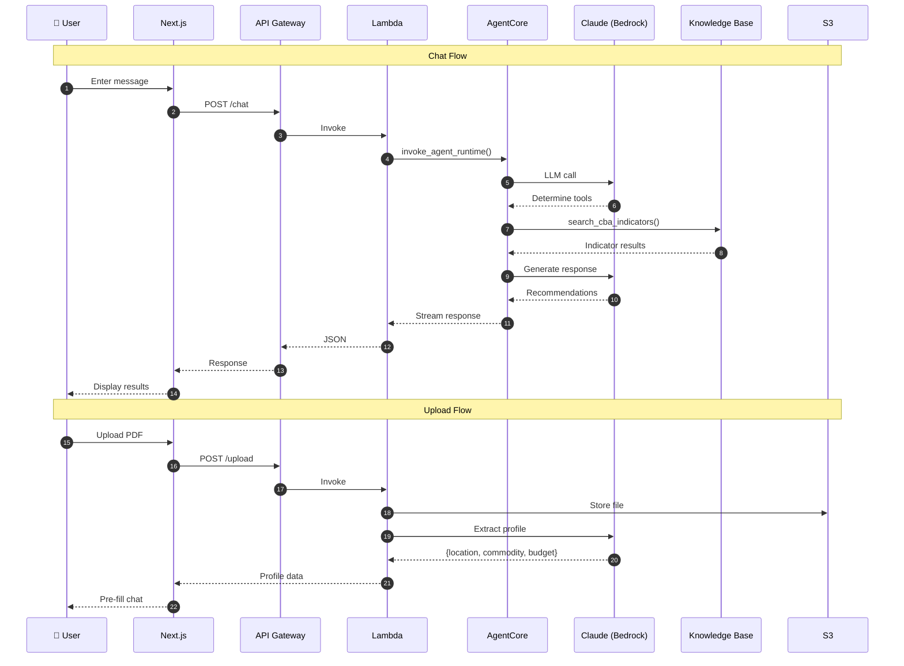
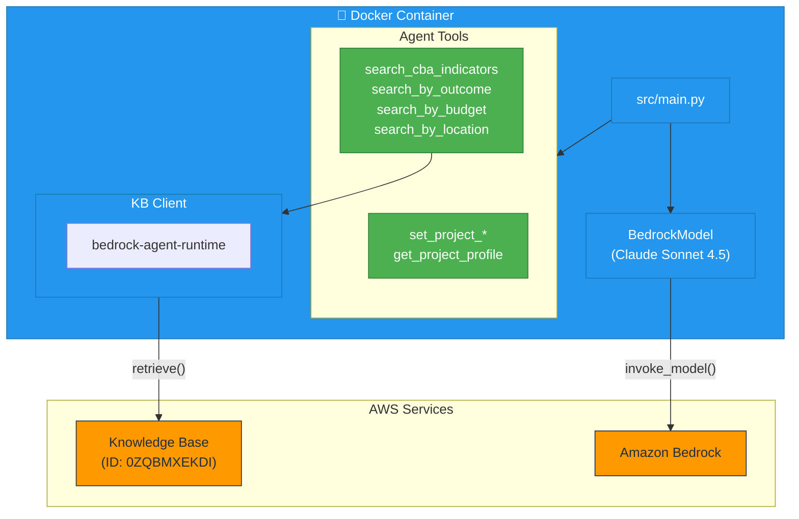

# CBA Indicator Selection Assistant - Architecture

This document describes the production architecture of the CBA (Circular Bioeconomy Alliance) Indicator Selection Assistant.

## System Overview



## Key Components

| Component | Purpose |
|-----------|---------|
| **`cba-frontend/`** | Next.js frontend with chat UI and file upload |
| **`lambda_function.py`** | Lambda handler routing `/chat` and `/upload` requests |
| **`agentcore-cba/`** | Bedrock AgentCore with Strands agent and KB tools |

---

## Bedrock AgentCore Infrastructure (CDK)

The agent runs on **AWS Bedrock AgentCore**, deployed via CDK:



### Infrastructure Resources

| Resource | Type | Purpose |
|----------|------|---------|
| **DockerImageStack** | ECR Asset | Builds agent Docker image |
| **AgentCore Runtime** | `CfnRuntime` | Runs containerized Strands agent |
| **AgentCore Gateway** | `CfnGateway` | MCP protocol for external tools |
| **AgentCore Memory** | `CfnMemory` | Session storage (30-day TTL) |
| **Cognito** | User Pool | JWT authentication for Gateway |

---

## End-to-End Data Flow



---

## Request Flow Details

### 1. Frontend → API Gateway

```typescript
// cba-frontend/lib/api.ts
const API_URL = "https://pjuuem2fn8.execute-api.us-west-2.amazonaws.com/prod";

await fetch(`${API_URL}/chat`, {
  method: "POST",
  body: JSON.stringify({ message, session_id, profile })
});
```

### 2. Lambda Routes Requests

```python
# lambda_function.py
def lambda_handler(event, context):
    if '/chat' in path:
        return handle_chat(event)      # → AgentCore
    elif '/upload' in path:
        return handle_upload(event)    # → S3 + Bedrock
```

### 3. AgentCore Invocation

```python
# handle_chat()
response = agentcore.invoke_agent_runtime(
    agentRuntimeArn='arn:aws:bedrock-agentcore:...:runtime/cbaindicatoragent_Agent-...',
    runtimeSessionId=session_id,
    payload=json.dumps({"prompt": message}).encode()
)
```

---

## AgentCore Container



---

## Knowledge Base Tools

| Tool | Purpose |
|------|---------|
| `search_cba_indicators(query)` | General indicator search |
| `search_indicators_by_outcome(outcome)` | Find indicators for project goals |
| `search_methods_by_budget(budget)` | Filter by budget constraints |
| `search_location_specific_indicators(location)` | Region-specific recommendations |

---

## Component Summary

| Component | Role |
|-----------|------|
| **API Gateway** | Public HTTP endpoint |
| **Lambda** | Request router → AgentCore for chat, S3+Bedrock for uploads |
| **AgentCore Runtime** | Containerized Strands agent |
| **AgentCore Gateway** | MCP protocol for external tools |
| **AgentCore Memory** | Session storage (30-day TTL) |
| **Knowledge Base** | 801 methods, 224 indicators |
| **Cognito** | JWT authentication |
