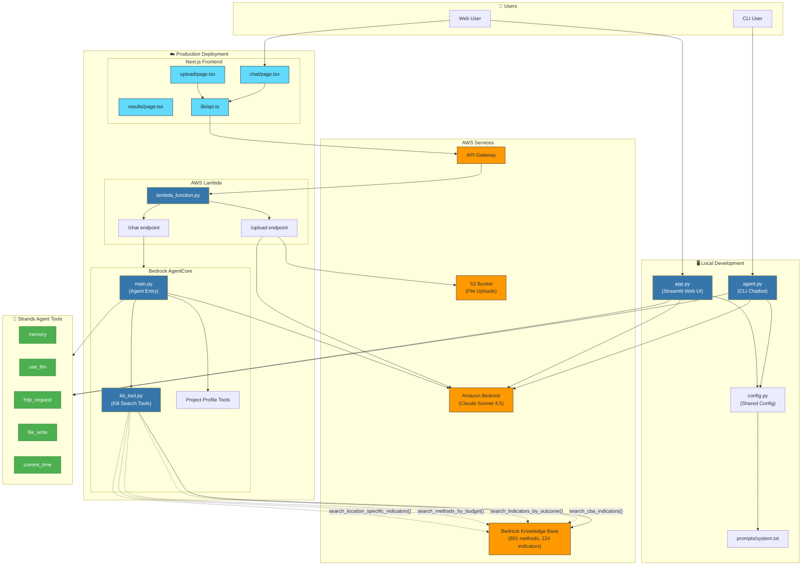
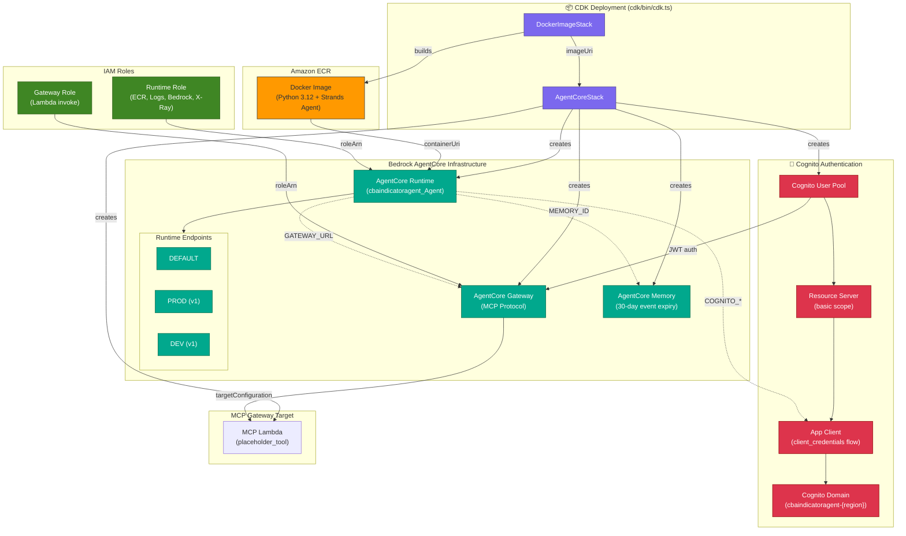
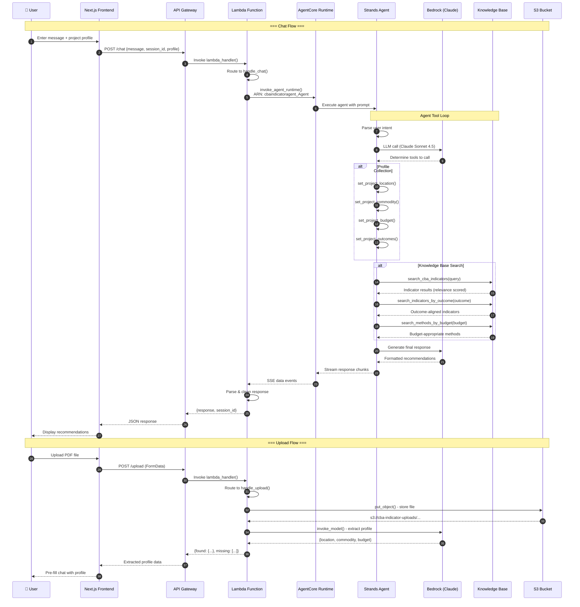
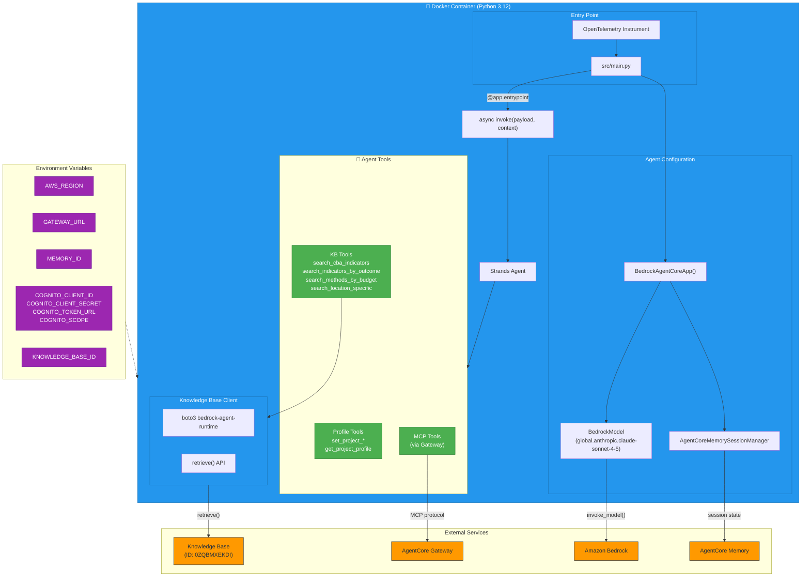
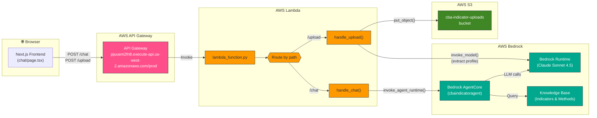

# CBA Indicator Selection Assistant - Architecture

This document describes the architecture of the CBA (Circular Bioeconomy Alliance) Indicator Selection Assistant.

## System Overview



## Key Components

| Component | Purpose |
|-----------|---------|
| **`src/agent.py`** | CLI chatbot for local testing with PDF/Excel file parsing |
| **`src/app.py`** | Streamlit web UI with session management and file upload |
| **`src/config.py`** | Shared configuration (model ID, KB ID, system prompt) |
| **`cba-frontend/`** | Production Next.js frontend with modern UI |
| **`lambda_function.py`** | AWS Lambda handler routing `/chat` and `/upload` requests |
| **`agentcore-cba/`** | Bedrock AgentCore deployment with KB search tools |

---

## Bedrock AgentCore Infrastructure (CDK)

The production agent runs on **AWS Bedrock AgentCore**, deployed via CDK. Here's the complete infrastructure:



### CDK Stack Components

| Resource | Type | Purpose |
|----------|------|---------|
| **DockerImageStack** | `ecr_assets.DockerImageAsset` | Builds and pushes agent Docker image to ECR |
| **AgentCore Runtime** | `bedrockagentcore.CfnRuntime` | Runs the containerized Strands agent |
| **AgentCore Gateway** | `bedrockagentcore.CfnGateway` | MCP protocol gateway for external tools |
| **AgentCore Memory** | `bedrockagentcore.CfnMemory` | Persistent memory with 30-day event expiry |
| **Cognito User Pool** | `cognito.UserPool` | JWT authentication for Gateway |
| **MCP Lambda** | `lambda.Function` | Placeholder tool for Gateway demonstration |

---

## End-to-End Data Flow

This diagram shows the complete request lifecycle from user input to response:



---

## AgentCore Container Architecture

The Strands agent runs inside a Docker container managed by AgentCore:



### Container Details

| Component | File | Purpose |
|-----------|------|---------|
| **Dockerfile** | `agentcore-cba/cbaindicatoragent/Dockerfile` | Python 3.12 slim + uv + OpenTelemetry |
| **Entry Point** | `src/main.py` | BedrockAgentCoreApp with `@app.entrypoint` |
| **Model Loader** | `src/model/load.py` | Returns `BedrockModel` with global inference profile |
| **KB Tools** | `src/kb_tool.py` | Boto3 calls to `bedrock-agent-runtime.retrieve()` |
| **MCP Client** | `src/mcp_client/client.py` | Cognito auth + streamable HTTP to Gateway |

---

## Production Request Flow (Lambda & API Gateway)



---

## Request Flow Code Details

### 1. Frontend → API Gateway

```typescript
// cba-frontend/lib/api.ts
const API_URL = "https://pjuuem2fn8.execute-api.us-west-2.amazonaws.com/prod";

// Chat request
fetch(`${API_URL}/chat`, { method: "POST", body: JSON.stringify({ message, session_id }) })

// Upload request  
fetch(`${API_URL}/upload`, { method: "POST", body: formData })
```

### 2. API Gateway → Lambda

API Gateway receives the HTTP request and invokes the Lambda function.

### 3. Lambda Routes the Request

```python
# lambda_function.py
def lambda_handler(event, context):
    path = event.get('rawPath', event.get('path', ''))
    
    if '/chat' in path:
        return handle_chat(event)      # → Bedrock AgentCore
    elif '/upload' in path:
        return handle_upload(event)    # → S3 + Bedrock Runtime
```

### 4a. Chat Flow: Lambda → AgentCore → Knowledge Base

```python
# handle_chat() calls AgentCore
response = agentcore.invoke_agent_runtime(
    agentRuntimeArn='arn:aws:bedrock-agentcore:us-west-2:...:runtime/cbaindicatoragent_Agent-...',
    runtimeSessionId=session_id,
    payload=json.dumps({"prompt": message}).encode()
)
```

### 4b. Upload Flow: Lambda → S3 → Bedrock (extract profile)

```python
# handle_upload() stores file and extracts project info
s3.put_object(Bucket=UPLOAD_BUCKET, Key=file_key, Body=file_bytes)
bedrock_runtime.invoke_model(modelId='...claude...', body=prompt)  # Extract location, commodity, budget
```

---

## Data Flow Summary

1. **User Input** → User provides project details (location, commodity, budget, outcomes)
2. **Agent Processing** → Strands Agent with Claude Sonnet 4.5 processes the request
3. **KB Search** → Agent queries Bedrock Knowledge Base for relevant indicators
4. **Recommendations** → Returns formatted indicator recommendations with methods, costs, and rationale

## Knowledge Base Tools

The agent uses specialized search tools to query the CBA M&E Framework:

| Tool | Purpose |
|------|---------|
| `search_cba_indicators()` | General indicator search |
| `search_indicators_by_outcome()` | Find indicators aligned with project goals |
| `search_methods_by_budget()` | Filter by budget constraints |
| `search_location_specific_indicators()` | Region-specific recommendations |

## Component Roles

| Component | Role |
|-----------|------|
| **API Gateway** | Public HTTP endpoint that routes requests to Lambda |
| **Lambda** | Request router + orchestrator - calls AgentCore for chat, S3+Bedrock for uploads |
| **AgentCore Runtime** | Hosts the containerized Strands agent |
| **AgentCore Gateway** | MCP protocol endpoint for external tools |
| **AgentCore Memory** | Persistent session/event storage (30-day TTL) |
| **Knowledge Base** | Vector store with CBA indicators/methods (801 methods, 224 indicators) |
| **Cognito** | JWT authentication for Gateway access |
